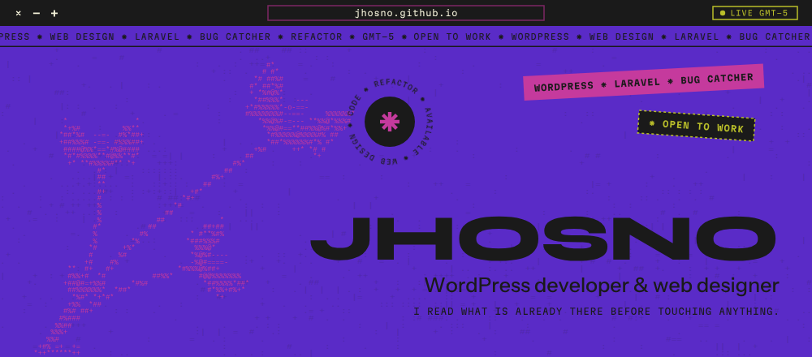
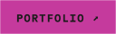
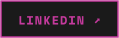
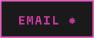
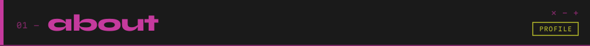
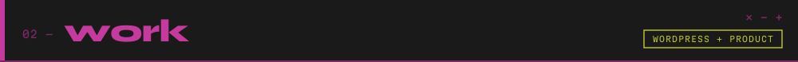
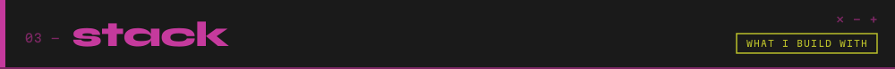
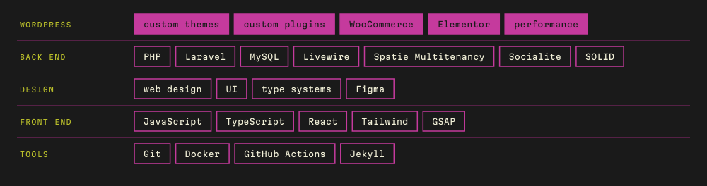
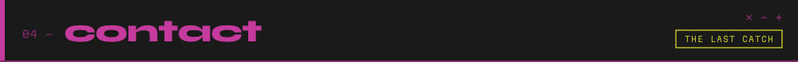

<p align="center">
  
</p>

<p align="center">
  <a href="https://jhosno.github.io"></a>&nbsp;
  <a href="https://www.linkedin.com/in/jhosno"></a>&nbsp;
  <a href="mailto:jhosno.dev@gmail.com"></a>
</p>



<table>
<tr>
<td width="60%" valign="top">

I build **custom WordPress** and design the sites I build. I also do **Laravel product work** on systems that are already in production.

Eight years in the PHP ecosystem. Bogotá, `GMT−5`, overlapping the US workday.

I start by reading what's already there: code someone else wrote, or someone else's words waiting for a site. Only then do I decide what it should be.

<br>

```
wordpress  themes · custom plugins · WooCommerce
design     web design · UI · type systems
stack      Laravel · PHP · MySQL
focus      multi-tenancy · payments · legacy
method     read · diagnose · refactor
status     open to full-time remote roles
```

</td>
<td width="40%" align="center" valign="middle">

<br>
<sub><code>state: wait → catch → wait</code></sub>
</td>
</tr>
</table>

<table>
<tr>
<th width="50%" align="left">✳ good fit</th>
<th width="50%" align="left">✳ not my thing</th>
</tr>
<tr>
<td valign="top">

Custom WordPress that needs a design, not a template<br>
Laravel systems already running in production<br>
Legacy code nobody wants to open<br>
Teams on US hours · full-time or white-label

</td>
<td valign="top">

Copywriting or photography — I design around yours<br>
Installing a theme and calling it design<br>
Touching code before reading it

</td>
</tr>
</table>



### Two publications, same agency, weeks apart

The brief both times was the login details and two adjectives: *"modern and pretty."* No design, no guide, nothing to inherit.

<table>
<tr>
<td width="50%" valign="top">
<a href="https://www.doverstreet.org"></a>

**[The Dover Street Examiner](https://www.doverstreet.org)**<br>
<sub>`wordpress` `web design` `elementor` · [before ↗](https://web.archive.org/web/20260307115301/https://www.doverstreet.org/) (archive.org, Mar 2026)</sub>

The voice was already paranoid parody. So direct it straight: the more convinced the design, the funnier the text.

<sub>**type** heavy grotesque + mono · **texture** real night photography</sub>
</td>
<td width="50%" valign="top">
<a href="https://www.cluteinstitute-onlinejournals.com"></a>

**[Clute Institute](https://www.cluteinstitute-onlinejournals.com)**<br>
<sub>`wordpress` `web design` `elementor` · [before ↗](https://web.archive.org/web/20260208090953/https://www.cluteinstitute-onlinejournals.com/) (archive.org, Feb 2026)</sub>

No color to inherit. Teal instead of every newspaper's navy, and far from Dover on purpose.

<sub>**type** high-contrast serif + mono · **texture** generative polygons</sub>
</td>
</tr>
</table>

Same Elementor install. Two sites with nothing in common, on purpose: two clients of one agency shouldn't converge.

<table>
<tr>
<td width="40%" valign="top">
<a href="https://amandaescalona.github.io/"></a>
</td>
<td width="60%" valign="top">

**[Amanda Escalona](https://amandaescalona.github.io/)** · <sub>landing page · 2025 · [before ↗](https://web.archive.org/web/20200909113858/https://amandaescalona.github.io/)</sub>

A freelance copywriter's site is her sales channel. No product to photograph, nothing to inherit: the only material was her own writing, in two languages. So the type system carries the design.

<sub>`landing page` `type system` `bilingual` `jekyll`</sub>

</td>
</tr>
</table>

### Product work

<table>
<tr>
<td width="50%" valign="top">

**[Creatienda](https://creatienda.cl)** · <sub>laravel · 2024 — now</sub>

Multi-tenant e-commerce SaaS for LATAM small businesses.

`symptom` coupled modules, slow to respond<br>
`catch` service layer, SOLID-oriented<br>
`outcome` **+20% response speed**

</td>
<td width="50%" valign="top">

**Multi-gateway payments** · <sub>creatienda · 2025</sub>

Every country with its own provider, every provider with its own contract.

`symptom` a new gateway meant touching the whole checkout<br>
`catch` Factory pattern behind one shared interface<br>
`outcome` a new provider without opening the core

</td>
</tr>
<tr>
<td width="50%" valign="top">

**BackOffice** · <sub>creatienda · 2025</sub>

The panel the SaaS is run from.

`symptom` fixed metrics: every new question was a ticket<br>
`catch` dynamic metrics with date-range filters<br>
`outcome` the team answers itself

</td>
<td width="50%" valign="top">

**MenúMaestro** · <sub>own product · 2018 — 2024</sub>

Digital QR menus for restaurants, built in four steps.

`symptom` changing one price meant reprinting the menu<br>
`catch` product upload, style editor, unique URL<br>
`outcome` the menu updates without going back to print

</td>
</tr>
</table>





<sub>The header, the flytrap and every panel on this page are SVG drawn from the same tokens and the same Dionaea code as <a href="https://jhosno.github.io">jhosno.github.io</a>. No stock, no templates.</sub>



> The cursor was never an arrow. It is the problem you brought in.

| | |
|---|---|
| **Open to** | full-time remote roles · agencies, studios and product teams |
| **Terms** | remote · white-label available |
| **Hours** | Bogotá `GMT−5`, overlaps the US workday |
| **I ship** | web design, visual system and the site running |
| **Languages** | native Spanish · English C2 *(EF SET 73/100)* |
| **To start** | send the stack trace, or two adjectives |

<details>
<summary><b>Español</b></summary>

<br>

Hago **WordPress a medida** y diseño los sitios que construyo. También hago **producto en Laravel** sobre sistemas que ya están en producción.

Ocho años en el ecosistema PHP. Bogotá, `GMT−5`, en horario compatible con Estados Unidos. Abierta a puestos full-time remotos y a trabajo white-label para agencias.

**Dos publicaciones, misma agencia, con semanas de diferencia.** El encargo las dos veces fueron los accesos y dos adjetivos: *«moderna y linda»*. Sin diseño, sin guía, nada que heredar. Mismo Elementor, dos sitios que no se parecen en nada, a propósito: dos clientes de una misma agencia no pueden converger.

**Lo que hago son dos cosas que parecen distintas.** Dar forma a lo que no la tiene —diseño web, UI, sistemas tipográficos— y arreglar lo que ya está corriendo —refactor, multi-tenancy, pasarelas de pago, legacy que nadie quiere abrir—. Es el mismo verbo: leer lo que escribió otro, código o texto, y encontrar dónde la realidad se separó de la intención.

**Para empezar:** traé el stack trace, o dos adjetivos.

</details>


<p align="center"><sub>🐈‍⬛ Cat parent to Hela, a very black cat. Art history in my spare time. The flytrap up top catches bugs; so do I.</sub></p>
